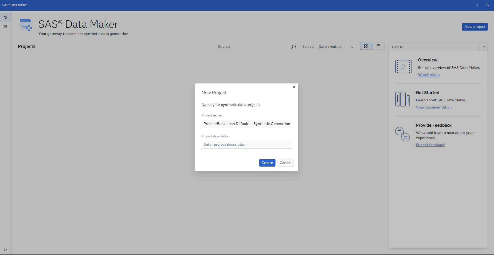
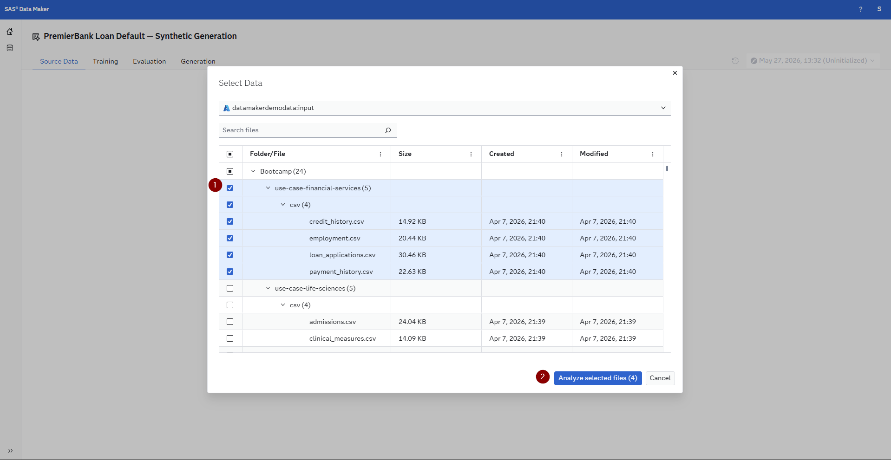
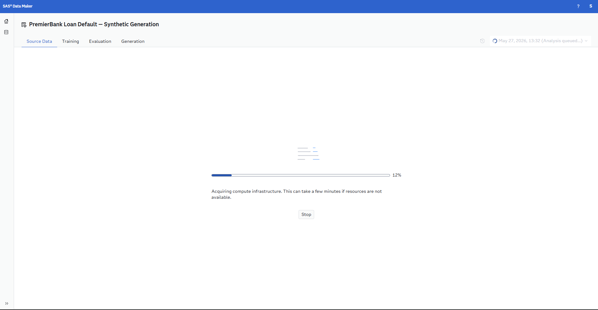
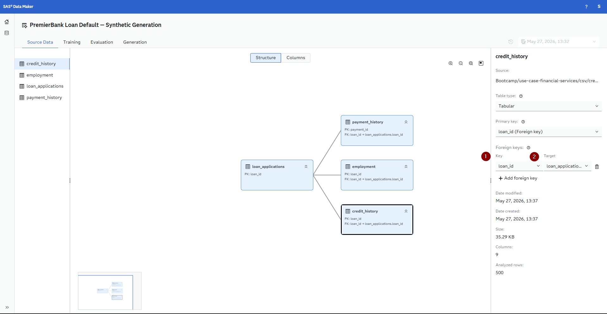
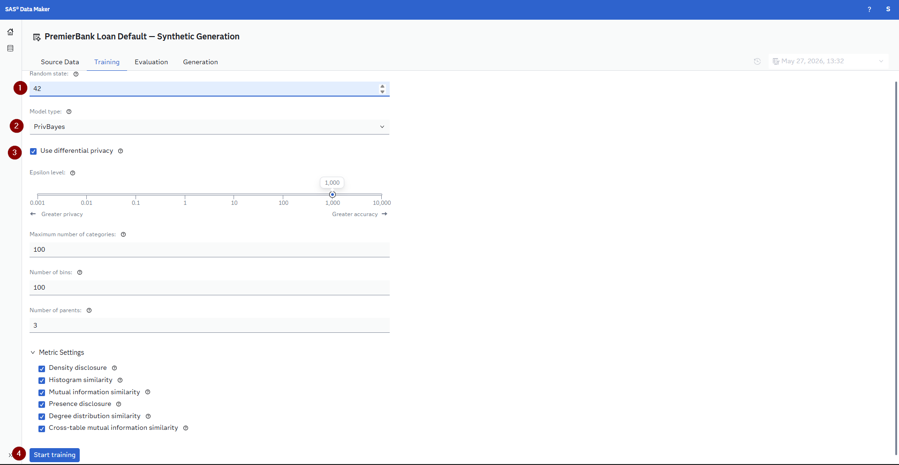
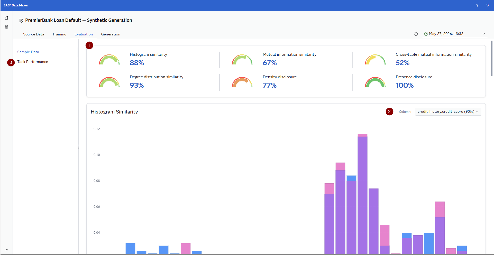
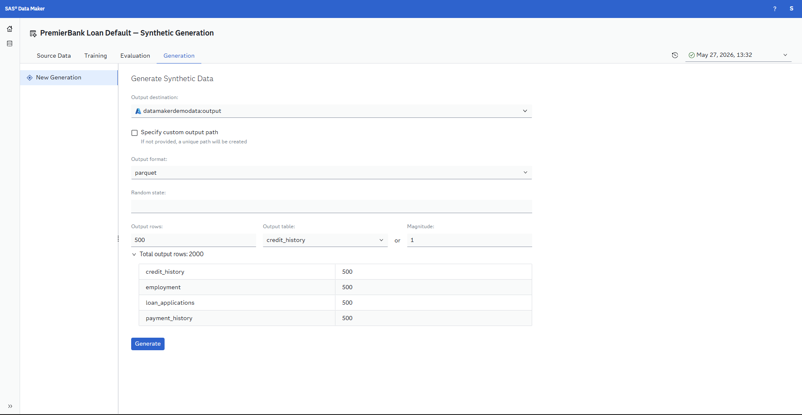
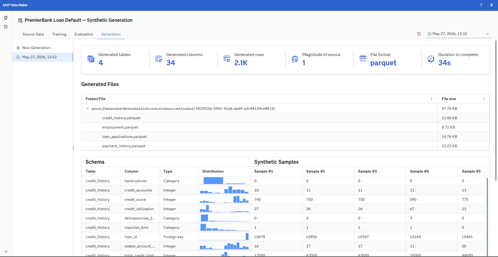

# Step 1: Ask & Access

Welcome to **PremierBank**, a fictional regional bank with $2.1 billion in assets and more than 50,000 customers. In this step you will gain insights into the current business challenges, learn about the value of synthetic data in financial services, and pull your data into **SAS Data Maker** to generate a synthetic version of the dataset.

---

## Regulatory Context

Financial services models operate under strict regulatory oversight. Key regulations that apply to this use case include:

| Regulation | What It Requires |
|-----------|-----------------|
| **ECOA** (Equal Credit Opportunity Act) | Prohibits discrimination in credit decisions based on race, color, religion, national origin, sex, marital status, age, or public assistance status |
| **Fair Housing Act** | Prohibits discrimination in housing-related lending |
| **FCRA** (Fair Credit Reporting Act) | Requires adverse action notices when credit is denied or terms are modified based on credit information |
| **SR 11-7** (OCC/Fed Model Risk Management) | Requires validation, documentation, and ongoing monitoring of models used in banking decisions |

These regulations mean that unlike many other analytics use cases, the model you build here must not only be accurate — it must be **explainable, auditable, and demonstrably fair**.

---

## The Value of Synthetic Data

Synthetic data is artificially generated data that mirrors the statistical properties, patterns, and structure of real-world data — without containing any actual records from the original dataset. It is produced using generative models that learn the distributions, correlations, and relationships present in real data and then create entirely new records that are statistically representative but not traceable back to any individual. In financial services, where data sensitivity and regulatory scrutiny are at their highest, synthetic data has become an essential tool for responsible analytics development.

For a use case like loan default prediction at PremierBank, synthetic data offers critical advantages that go beyond general privacy protection. First, lending data is among the most sensitive data a bank holds — it includes income, employment, credit scores, and debt levels, all of which are personally identifiable and regulated under GLBA (Gramm-Leach-Bliley Act) and FCRA. Synthetic data allows analytics teams, model validators, and external partners to work with realistic data without exposing actual borrower records or triggering data-sharing compliance obligations. Second, synthetic data is uniquely valuable for **fair lending testing**: teams can generate synthetic populations with controlled demographic distributions to stress-test whether a model produces disparate impact across protected classes, even when the original dataset may not contain sufficient representation of minority groups. Third, synthetic data enables **stress testing and scenario analysis** — what happens to default predictions if unemployment doubles, if interest rates spike by 200 basis points, or if a new loan product is introduced? These forward-looking scenarios can be modeled synthetically before they occur in reality, giving the credit committee early insight into portfolio resilience.

---

## Working with SAS Data Maker

[SAS Data Maker](https://www.sas.com/en_us/software/data-maker.html) is the SAS platform for generating high-quality synthetic data. In this section you will pull the PremierBank datasets into SAS Data Maker and create a synthetic version that preserves the statistical relationships across all four tables.

### Log into SAS Data Maker

The SAS Hackathon Bootcamp mentors will provide you with three links, a username and a password. Your username and password are consistent across all three environments. In order to access SAS Data Maker please enter the link that contains the word Data Maker. Here you will be asked to sign in using an Username/E-Mail and then enter a password - these are the once provided to you by the mentors. Please note if you have a SAS Communities profile do not log in using those credentials and if you see an error trying to log in, try to use an incognito browser tab, as you might still be logged into SAS somewhere.

### Generating Synthetic Data with SAS Data Maker

Follow these steps to create your synthetic dataset:

#### 1. Create a Project

1. Open **SAS Data Maker**
2. Click **New project** to start a new project
3. Give it a descriptive name, e.g., *PremierBank Loan Default — Synthetic Generation*

#### 2. Import Source Data

1. Within your data plan, click **Add Data Source**
2. Navigate to the `Bootcamp/use-case-financial-services/csv` folder
3. This will import all four CSV files:
   - `loan_applications.csv` — this is your primary entity table
   - `credit_history.csv` — related table linked by `loan_id`
   - `employment.csv` — related table linked by `loan_id`
   - `payment_history.csv` — child table linked by `loan_id` (multiple payments per loan)
4. SAS Data Maker will profile each table and display column types, distributions, and summary statistics

Next you will see a loading bar like the one below that, this should finish in less than two minutes - feel free to start reading the next step already while you wait for this to finish:

#### 3. Define Relationships

The job that ran to understand the tables also will try to resolve the relationships between the tables. Please review that the relationship is mapped correctly. Your goal is to map a relationship that looks like the one below, but initially it will not look like.

In order to connect the tables correctly please click on each table and then on the right hand side under *Foreign keys* change the *Key* and *Target* values as described below

1. For `loan_applications`, set `loan_id` as the Primary key
2. For `payment_history` set `payment_id` as the Primary key and `loan_id` as the Foreign key mapping to `loan_applications`
3. For `credit_history` and `employment`, set `loan_id` as the Foreign key mapping to `loan_applications` - these two tables use the `loan_id` as a Foreign key and their Primary key.
    
4. All tables are of the type Tabular
5. Review the key relationships between the tables:
   - `credit_history.loan_id` -> `loan_applications.loan_id`
   - `employment.loan_id` -> `loan_applications.loan_id`
   - `payment_history.loan_id` -> `loan_applications.loan_id`
6. These relationships ensure that the synthetic data maintains referential integrity — every synthetic payment record will belong to a valid synthetic loan

#### 4. Training Settings

1.   **Random state**, is optional and can be set to a seed variable. Why not try a classic like 42?
2.   **Model type**, we can choose between `PrivBayes` and `SMOTE` , we will be using `PrivBayes` here to make use of the differential privacy feature
3.   **Use differential privacy**, this will help us to reduce the privacy impact on each individual in the data. Increasing the privacy is a great way to enhance your Trustworthy AI as it increases the trust in you as a data processor
4.   The rest of the values we can leave at the default values and click the Start training button. If you want to feel free to explore the options though in more detail there is inline hints, or reach out to one of the SAS Mentors on site.
5.   The training process will take a moment and once it is done and all the metrics are calculated we can move to the next step which is `Evaluation`

#### 5. Evaluation

On the Evaluation tab we get a lot of insights into our Synthetic Data Generation Model, how it compares to the input sources and not just on a per table basis but also across the different tables.

Please take your time and explore these results to gain an understanding of how closely the synthetic data will match the original data sources. Feel free to discuss these results in the group and also reach out to SAS Mentors on site if you have question or consult the [SAS Documentation](https://go.documentation.sas.com/doc/en/sdgcdc/v_001/sdgug/p0ki9glx7acxpyn1wttognicd7qi.htm).

#### 6. Generation

1. **Output destination**, select the path `datamakerdemodata:output` here and set the *Output format* to one that you prefer (for example *parquet*)
2. Leave all other options at default and click the Generate button
    
3. Now a generation job is triggered that will create the synthetic data for each table for us
4. Once the generation has finished we get a summary of everything, a note on where the data is stored and a sample of the synthetic data. The generated data is stored onto a blob storage, don't worry you will not have to download anything onto your laptop as we will provide the data already available in SAS Viya and SAS Viya Workbench so that you can get to work

---

## Next Steps

Proceed to **[Step 2: Prepare](../2-prepare/)** to load, profile, and join the data into an analytical base table using SAS Viya Workbench.
