# Step 5: Deploy & Act

In this final step you will use **SAS Intelligent Decisioning** to operationalize your loan default prediction model by embedding it in an automated loan approval decision flow. You will also explore its **Copilot** and learn how decisions can function as **tools in agentic workflows** — or become agentic workflows themselves.

---

## Prerequisites

Your champion model should be registered in **SAS Model Manager** from Step 4. SAS Intelligent Decisioning will pull the model directly from the Model Manager registry. If you did not register your own do not worry a default one is provided.

---

## What is SAS Intelligent Decisioning?

SAS Intelligent Decisioning is the platform for creating, managing, and executing business decisions that combine analytical models, business rules, and contextual logic into a single decision flow. Instead of just scoring a loan application with a model, a decision flow can:

- Score the application's default probability
- Classify it into a risk tier
- Apply business rules (e.g., "never approve if LTV > 95%")
- Determine the appropriate action (approve, review, decline)
- Generate adverse action reason codes for declines
- Return a complete lending recommendation

This turns a model prediction into an **actionable lending decision**.

If you have any questions around SAS Intelligent Decisioning activate the SAS Viya copilot within the application via the icon in the top right hand corner next to your profile or ask one of the onsite SAS Mentors.

---

## Creating a Loan Approval Decision

### 1. Open SAS Intelligent Decisioning

1. From the SAS Viya main menu, navigate to **SAS Intelligent Decisioning** (under *Build Decisions*)

2. Click **New Decision**

3. Name it: *PremierBank Loan Approval Decision*

4. Leave the Description, Location and Workflow on default and click OK
    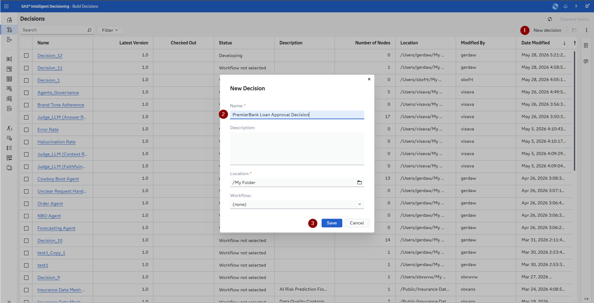

5. Navigate to the *Variables* tab, click on the *Add variable* dropdown and either select *Custom variable* if you want to add them all yourself or *Decision* if you want to copy it from the template (this is faster). The manual steps are described in the below sub steps 1 & 2 while the copy is described in step 3:
    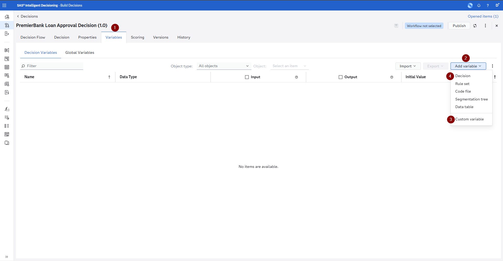
    
    1. Define the **input variables** (these will be passed in when the decision is called) - The structure is: `name` (data type):
        1. `loan_id` (character)
        2. `credit_score` (decimal)
        3. `debt_to_income` (decimal)
        4. `loan_to_value` (decimal)
        5. `annual_income` (decimal)
        6. `income_verified` (decimal)
        7. `loan_amount` (decimal)
        
    2. Define the **output variables** (what the decision returns)  - The structure is: `name` (data type) - Explanation (this is just for us as context):
        1. `decision` (character) - Approve, Review, or Decline
        2. `risk_tier` (character) - risk classification
        3. `conditions` (character) - any conditions attached to approval
        4. `reason` (character) - why a credit was declined
        5. `rate_adjustment` (decimal) - basis point adjustment to base rate
        6. Now click OK to add all of them
        
        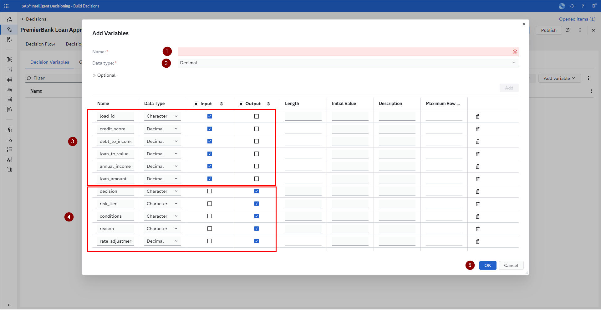
        
    3. Copy the **variables** from the template decision:
        1. Click on the folder icon in the *Decision* input field
        2. Navigate to *SAS Content > SAS Hackathon Bootcamp 2026 > Use Case Financial Services* select *PremierBank Loan Approval Decision* and click OK
        3. Click on the *Add all* icon in the middle of the dialogue to bring all the variables into your decision and then click the Add button

Once you have added the variables (no matter which way you choose) please click on the save icon in the upper right hand corner. It is recommended that anytime you change something about the variables before you continue to quickly use this icon to save the changes.


From here you can also always activate the SAS Viya Copilot via the icon in the top right hand corner to ask questions about SAS Intelligent Decisioning to deepen your understanding of the application.

### 2. Add the Model Node

1. Switch to the *Decision Flow* tab.
2. In the decision flow canvas, you can either right click the *Start* node and from the context menu select *Add below > Model* or on the right hand side click on the icon that looks a little bit like a postcard and from that side bar drag & drop a model node onto the *Start* node.
    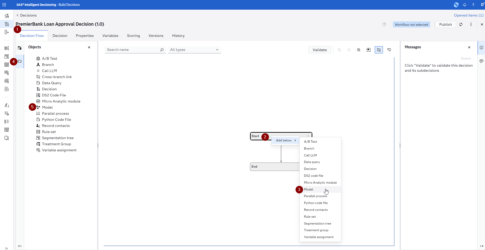
3. Select your registered champion model from SAS Model Manager or the pre-registered champion model by navigating to *DM Repository > PremierBank Loan Default Prediction > Version 1 > Gradient Boosting (1) (SAS Automatically Generated Pipeline* and click OK.
    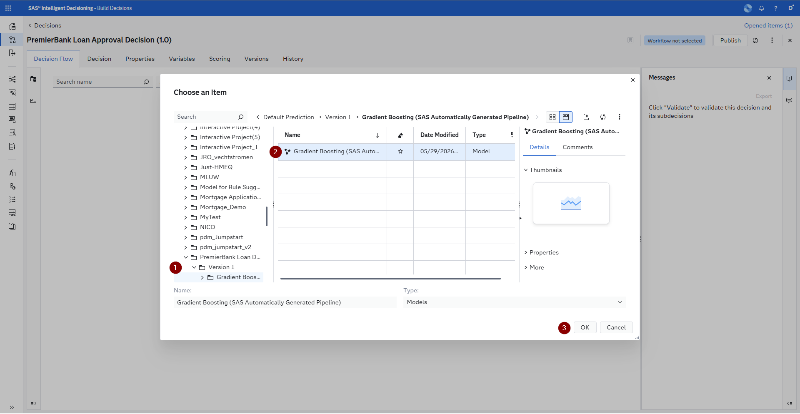
4. Upon doing this you will see a little red error icon next to the model and that is because it is missing variable inputs and outputs - we will address this in the next steps.
5. Map the input variables to the model's expected features:
    1. For the inputs map `income_verified` and the `loan_id` should be mapped automatically.
        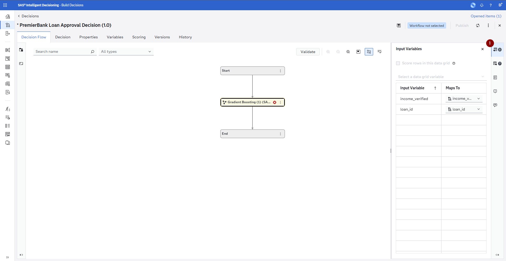
    2. For the outputs we are going to be clicking the *More* menu up top and select *Add missing variables* this will add all of the required output variables to our decision - if you copied the variables using the template they are already present - in the dialogue please make sure to deselect them from the Output as we will create our own custom outputs - and since we changed something about the variables remember to click the save icon (you will be asked to remove not used variables just select no, as we will be using those in the next steps).
        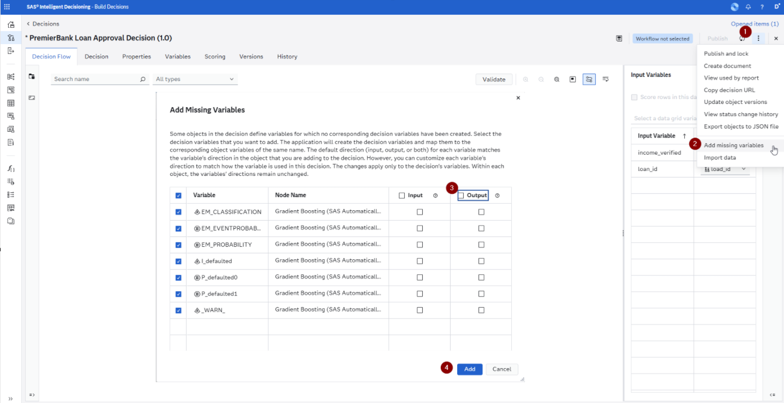


### 3. Add Business Rules

After the model scores the application, add **Rule Set** nodes to determine the lending decision. For this make first sure that you have clicked the save icon of your decision and than we will be adding Rule Sets to our decision.

There are two ways of adding **Rule Sets** to the decision:

1.    *The easy way*, where you use the pre build rule sets by clicking on the three vertical dots on the model node and selecting *Add > Rule Set*, then in the dialogue navigate to *SAS Content > SAS Hackathon Bootcamp 2026 > Use Case Financial Services* and add the rule set as specified below.
2.   *The learning way*, if you want to create them yourself you can go to the right hand side click on the *Objects* (postcard icon) and drag & drop a Rule Set onto the previous node. This will open up a dialogue where you should name your decision correspondingly, please leave the location as the default (*My Folder*) - then add the variables from the decision you created and start building the Rule Sets as described below - the required variables are noted either as the columns or in the **Rule Conditions**. The first rule set we will be building has notes and screenshots attached on how to do this.

We recommend you try to build at least one of these rule sets yourself to get an understanding of how it is done. If you have any questions around SAS Intelligent Decisioning activate the SAS Viya copilot within the application via the icon in the top right hand corner next to your profile or ask one of the onsite SAS Mentors.

**Rule Set: Risk Tier Classification**

1.   From the *Objects* side panel drag and drop a *Rule Set* node onto the *Model* node you already have in your decision. Then enter the name from above and click *Save*
     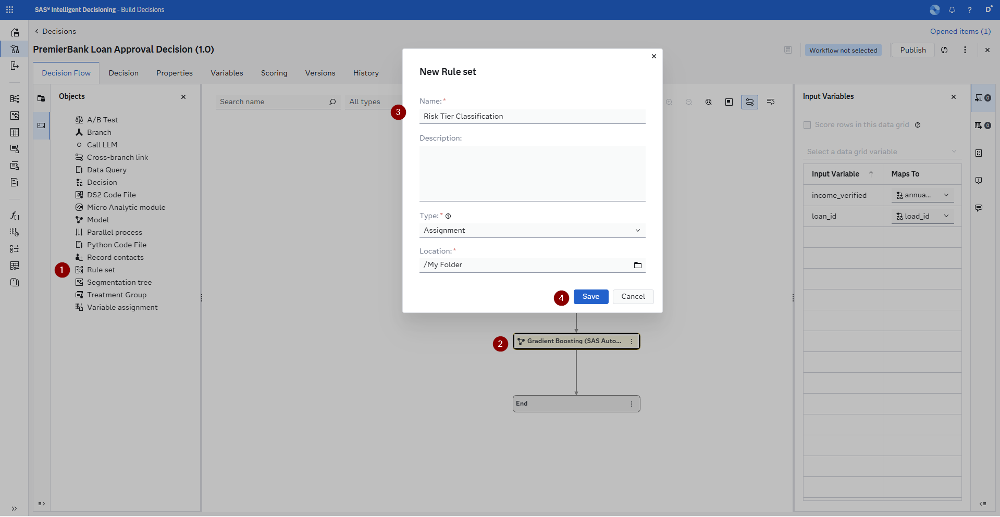

2.   Now on the right hand side you will see the *Properties* pane for this new *Rule Set* and there is a button *Open* that will take you to the *Rule set editor* so that you can build the decision so click on that button.

3.   A new UI opened up for you on the *Variables* tab for the *Rule Set*, under *Add variable* select, via the folder icon navigate to *My Folder* and select the *PremierBank Loan Approval Decision* that you have already created. Select the **P_defaulted1** & **risk_tier** variables and add it to the Rule Set - the **P_defaulted1** variable is specified in the Rule Conditions column in the table below and the **risk_tier** variable has its own column as it gets assigned values.

     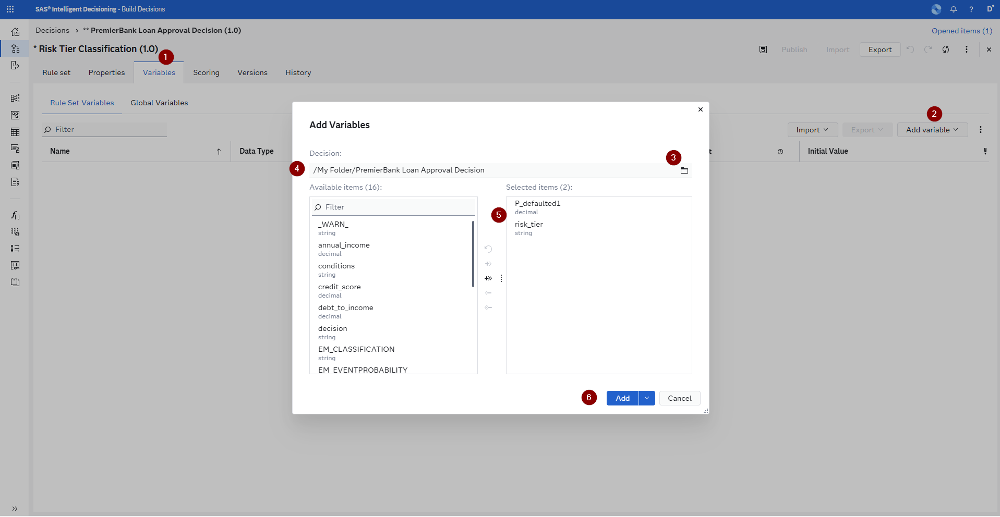

4.   For the **P_defaulted1** change it so that it is required as an input and then click on the save icon to add this change. The **risk_tier** currently doesn't have any value from the decision so we can just leave it as an output.
     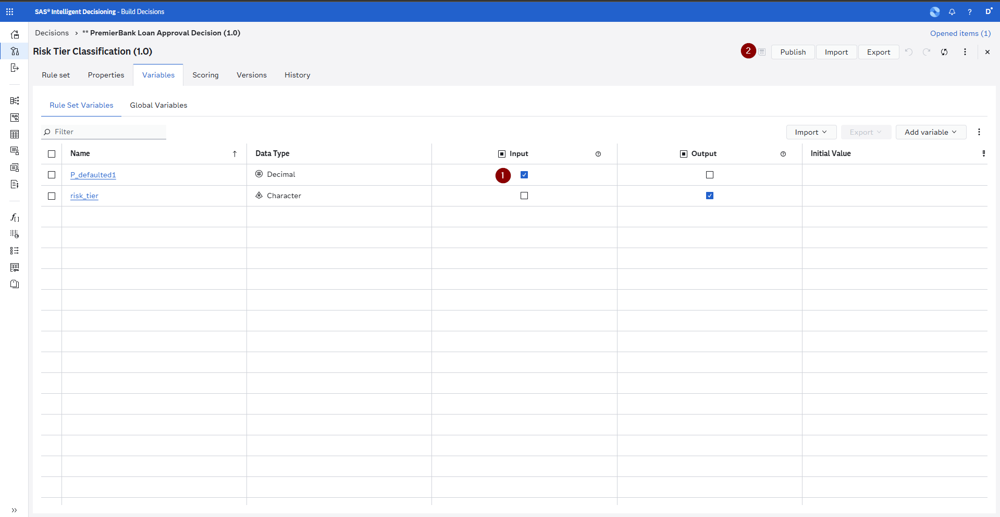

5.   Navigate to the *Rule set* tab and click on the *Add rule* button
     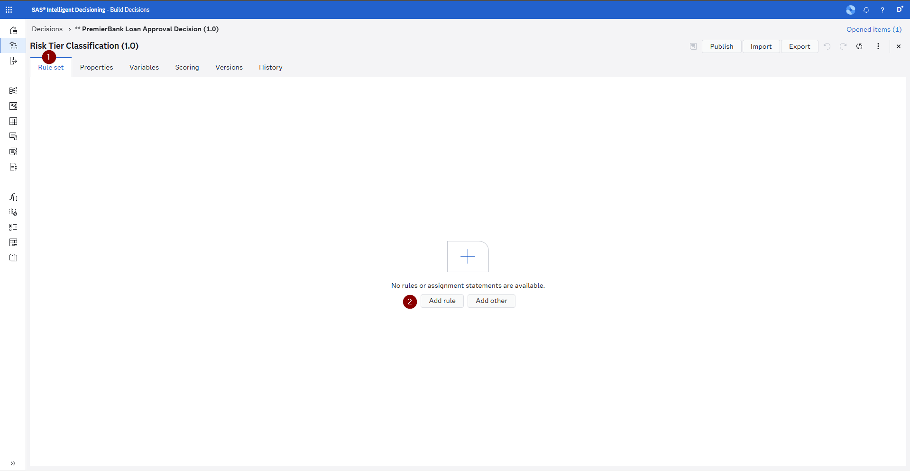

6.   Change the operator from the default of equal to greater than and then enter the comparison in the *IF* condition, in the THEN assignment change the variable to **risk_tier** and enter the corresponding value into the field enclosed in single quotes.
     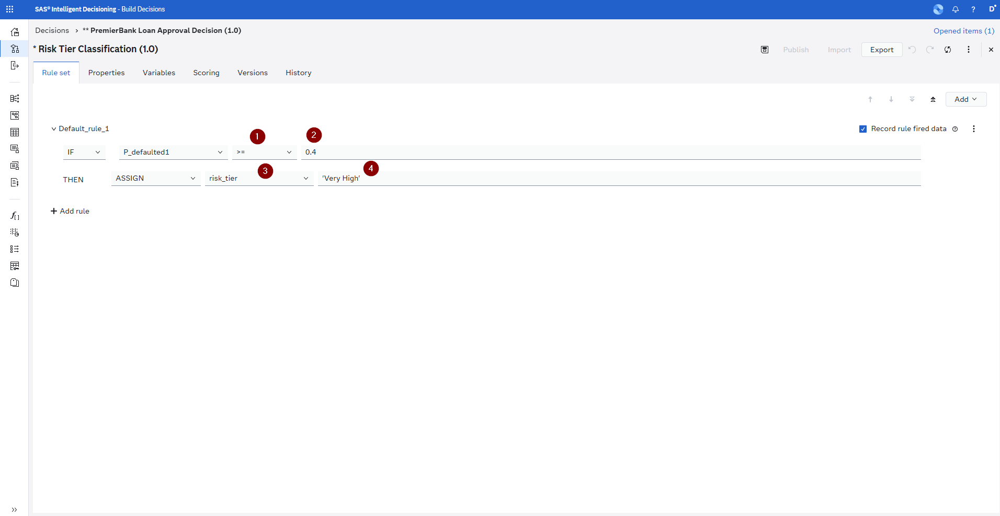

7.   Next click on *Add rule* and click on the *IF* statement dropdown and change it to an *ELSE* condition. This will combine the additional condition into one rule. From here continue to enter all the rest of the conditions and assignments as listed below and once you are done click on the save icon and then either use the little *x* icon in the right hand corner or click on *** PremierBank Loan Approval Decision (1.0)* in the breadcrumb navigation up top to navigate back to the decision.
     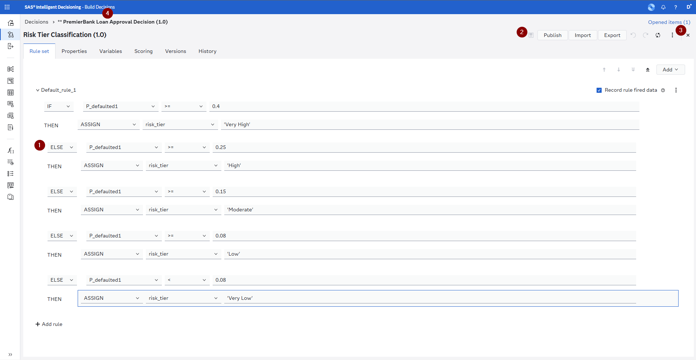

| Rule Conditions | risk_tier |
|-----------|-----------|
| P_defaulted1 >= 0.40 | Very High |
| P_defaulted1 >= 0.25 | High |
| P_defaulted1 >= 0.15 | Moderate |
| P_defaulted1 >= 0.08 | Low |
| P_defaulted1 < 0.08 | Very Low |

**Rule Set: Lending Decision**

| risk_tier | credit_score | decision | conditions |
|-----------|-------------|----------|------------|
| Very High | Any | Decline | Generate adverse action codes |
| High | < 620 | Decline | Generate adverse action codes |
| High | >= 620 | Review | Manual underwriter review required |
| Moderate | Any | Review | Verify employment and income |
| Low | Any | Approve | Standard terms |
| Very Low | Any | Approve | Preferred rate eligible |

**Rule Set: Rate Adjustment (Risk-Based Pricing)**

The period for the rate_adjustment when the risk_tier is *Very High* indicates represents a missing value.

| risk_tier | rate_adjustment |
|-----------|-----------------------|
| Very High | . |
| High | 200 |
| Moderate | 100 |
| Low | 0 |
| Very Low | -25 |

**Rule Set: Hard Cutoff Rules**

These rules override the model-based decision regardless of score:

| Rule Conditions | decision | reason |
|-----------|----------|--------|
| loan_to_value > 0.95 | Decline | Insufficient equity |
| debt_to_income > 0.50 | Decline | Excessive debt burden |
| credit_score < 500 | Decline | Credit score below minimum |
| loan_amount > 10 x annual_income | Decline | Loan exceeds income multiple |

### 4. Adding an LLM to the Mix

We are going to be adding a Large Language Model to our decision now. For this please open up the *Objects* side bar (postcard icon) and drag & drop a Call LLM node onto the *End* node. Then go ahead and add the missing variables like you did for the model node (do not make the prompt a required input for the decision) - and make sure to click on the save icon.


Now you can either add the *Prompt Assignment* Rule Set to the decision just like you added the other Rule Sets before or you can create it yourself. If you choose to create it yourself, please add the following variables from your decision as inputs to it:

-   annual_income
-   conditions
-   credit_score
-   decision
-   reason
-   risk_tier

And as output add the prompt variable (do not forget to click the save icon). Then switch to the *Rule set* tab, click on the *Add other* button, select the Rule type of *Assignment* and click *OK* - as we do not want to do a condition, but rather just fill in our prompt with a long value.

Next you are going to assign the prompt value by clicking on the pencil icon, in the *Expression Editor* removing all the values from the main editor and the copy and paste the value from below into it, then click the *Save* button, the save icon on the *Rule set* and return to the main decision.

```
prompt = CAT('You are a professional PremierBank loan advisor. Using the loan application data below, write a warm, respectful, and clearly structured long-form explanation (3 to 5 paragraphs) that an applicant with no financial background can read to understand the outcome of their application and what it means for them. Do not expose internal codes or jargon verbatim — translate them into plain consumer-friendly language. Do not promise that the decision can be overturned, and do not provide legal or regulatory advice. Application and decision context: Annual income: $', annual_income, '. Credit score: ', credit_score, '. Assigned risk tier: ', risk_tier, '. Final decision: ', decision, '. Internal reason code: ', reason, '. Conditions attached to this decision: ', conditions, '. Structure your response as follows. First, open with a personal respectful acknowledgment that PremierBank has reached a decision of ', decision, ' on the application, and thank the applicant for choosing PremierBank Second, explain in plain language what a risk tier of ', risk_tier, ' means in the context of a credit score of ', credit_score, ' and a reported annual income of $', annual_income, '. Describe how these two indicators, combined with the overall profile, shape how PremierBank assesses repayment capacity. Third, expand the internal reason ', reason, ' into a clear, empathetic explanation of why the decision came out the way it did. Avoid financial jargon — translate terms such as debt-to-income, loan-to-value, or adverse action codes into everyday language. Fourth, describe the conditions attached to this decision — ', conditions, ' — and explain exactly what the applicant needs to do (documents to provide, verifications to complete underwriter steps) for those conditions to be satisfied. If no conditions apply, briefly say so. Fifth, close with constructive, forward-looking next steps tailored to the decision ', decision, '. If declined, suggest 2 to 3 concrete, realistic actions the applicant can take over the next 6 to 12 months to strengthen a future application (for example, improving credit score, reducing debt obligations, or increasing documented income). If approved or sent to review, outline what the applicant should expect next and how they will be contacted. Tone: warm, professional, encouraging, and never condescending Length: 350 to 500 words. Write in the second person (you, your application).')
```

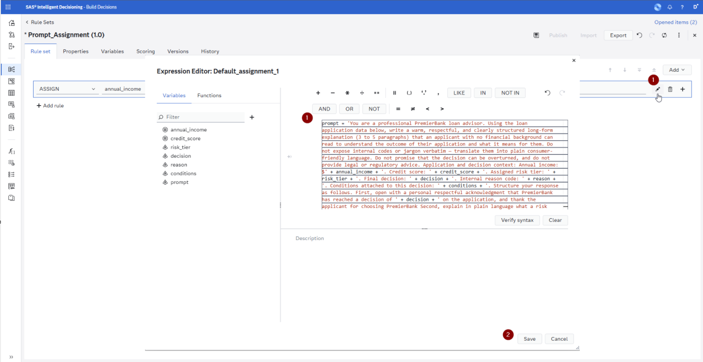

This is a very simplistic approach to prompt engineering and also doesn't provide you with the ability to test and compare different large languages models. That is why SAS provides the [SAS Agentic AI Accelerator](https://github.com/sassoftware/sas-agentic-ai-accelerator) open-source project, which enables you to connect any LLM and do extensive prompt engineering & monitoring, but here we have a hard coded LLM (OpenAI GPT 5.4) available.

### 5. Test the Decision

1. In the decision click on the *Scoring* tab and then in there click on the *Scenarios* sub tab

2. Click on the *New test* button
    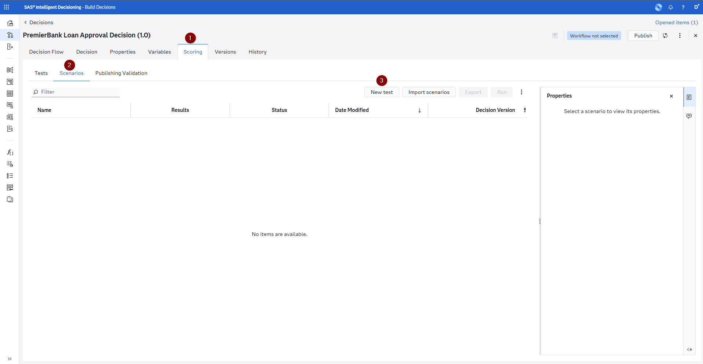

3. In the *New Scenario* window leave the name on the provided default, set the location to *My Folder* and the output table location to your *CASUSER* - see screenshot below

4. Enter sample values:

   - annual_income: 55000
   - credit_score: 610
   - debt_to_income: 0.42
   - income_verified: 1
   - loan_amount: 180000
   - loan_id: L0042
   - loan_to_value: 0.85

   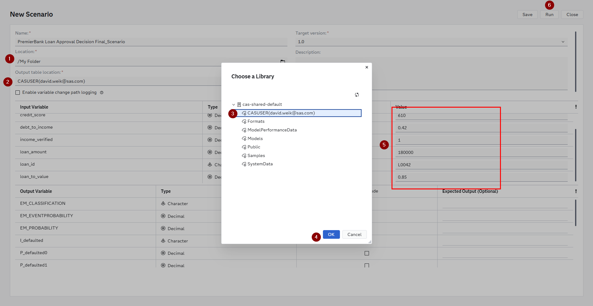

5. Review the output by clicking on the Results icon once the *Status* as switched to a green check mark
    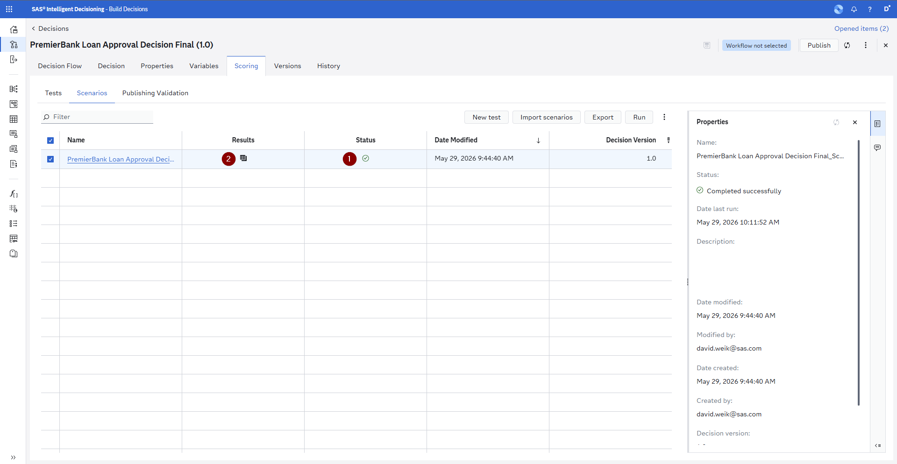

6. Fell free to further test with different scenarios to validate the logic:
   - A strong applicant (high score, low DTI, low LTV) should be approved with preferred rate
   - A borderline applicant should be sent to review
   - A high-risk applicant should be declined with clear reason codes

### 6. Publish the Decision

1. Click the **Validate** button and then **Publish** to make the decision available as a callable service
2. Choose a **destination:**
   - **CAS** — for batch scoring of the entire loan portfolio
   - **MAS (Micro Analytic Service)** — for real-time API calls during the loan application process - only one available here!
   - **Container** — for deployment in the bank's loan origination system
3. Please make sure to give it a unique name
3. Once published, the decision is available as a REST API endpoint

---

## Using the SAS Intelligent Decisioning Copilot

The Copilot in SAS Intelligent Decisioning is a conversational assistant that can answer questions about the documentation for **SAS Intelligent Decisioning**, **SAS Container Runtime**, and **SAS Micro Analytic Service**. Use it to quickly find information about how these products work without leaving the application.

### What the Copilot Can Do

- **Answer documentation questions** about SAS Intelligent Decisioning features, concepts, and workflows
- **Explain SAS Micro Analytic Service (MAS)** deployment options, configuration, and API usage
- **Clarify SAS Container Runtime** setup, publishing, and management
- **Help you navigate** product capabilities by describing how specific features work
- **Provide guidance** on decision flow concepts, rule set configuration, and publishing options based on the official documentation

### Example Copilot Prompts

- *"How do I publish a decision to MAS?"*
- *"What is the difference between CAS and MAS as publishing destinations?"*
- *"How does SAS Container Runtime work for deploying decisions?"*
- *"What types of nodes can I add to a decision flow?"*
- *"How do I configure input and output variables for a decision?"*
- *"What are the options for generating adverse action codes in a decision flow?"*

The Copilot is a useful reference tool for quickly getting answers about the platform's capabilities while you are building your decision flows.

---

## Decisions as Tools in Agentic Workflows

A published SAS Intelligent Decisioning decision is exposed as a **REST API endpoint**. This means it can be called as a **tool** by any AI agent — including large language model (LLM) agents that use tool-calling capabilities.

### How This Works

```
┌──────────────┐     ┌─────────────────────────┐     ┌──────────────────┐
│   AI Agent   │────>│  SAS Intelligent         │────>│  Lending         │
│  (Loan       │     │  Decisioning API         │     │  Decision        │
│   Officer    │     │  /decisions/loanApproval  │     │  + Adverse       │
│   Agent)     │<────│                          │<────│  Action Codes    │
└──────────────┘     └─────────────────────────┘     └──────────────────┘
```

**Example scenario:** A loan officer agent (powered by an LLM) is assisting an applicant through the digital application process. The agent can:

1. Collect the applicant's information through a conversational interface
2. **Call the SAS Intelligent Decisioning API** with the application data
3. Receive back: "Decline — AA01: Credit score too low; AA03: History of late payments"
4. Communicate the decision to the applicant with the required adverse action notice
5. If the decision is "Review," escalate to a human underwriter with the full risk assessment

The decision becomes a **tool** in the agent's toolkit, just like a document retrieval function or a customer lookup. This bridges the gap between analytical models and conversational AI in a heavily regulated industry.

### Why This Matters for Financial Services

- **Consistency:** Every application receives the same decision logic — no variance between loan officers or branches
- **Governance:** The decision is version-controlled and auditable in SAS Intelligent Decisioning, not buried in an LLM's system prompt
- **Regulatory compliance:** The decision flow enforces adverse action notice generation, hard cutoff rules, and fairness guardrails — the LLM agent cannot override these
- **Separation of concerns:** Data scientists own the model, credit risk owns the rules, compliance owns the fairness constraints, and the AI agent just calls the endpoint
- **Real-time execution:** MAS endpoints return in milliseconds, fast enough for real-time application processing

---

## Decisions as Agentic Workflows

Beyond being called as tools, SAS Intelligent Decisioning can itself orchestrate **agentic workflows** — multi-step processes that autonomously execute a chain of decisions and actions.

### How a Decision Becomes an Agent

An agentic decision flow goes beyond simple "input -> rules -> output." It can:

1. **Observe:** Receive a trigger event (e.g., a borrower has missed their second consecutive payment)
2. **Reason:** Score the borrower's updated default probability, check their current risk tier, review their payment history trend
3. **Decide:** Select the optimal intervention — modify terms, offer forbearance, escalate to collections, or continue monitoring
4. **Act:** Trigger downstream actions — send a letter, create a workout case, adjust the loan's risk rating, notify the loan officer
5. **Monitor:** Track whether the borrower resumes payments and feed that outcome back into future decisions

### Example: Automated Portfolio Monitoring Agent

```
┌─────────────┐     ┌──────────────────┐     ┌──────────────────┐
│  Event       │     │  Decision Flow   │     │  Actions         │
│  Trigger     │────>│                  │────>│                  │
│              │     │  1. Score model   │     │  • Send notice   │
│  "Borrower   │     │  2. Apply rules   │     │  • Modify terms  │
│   missed     │     │  3. Select action │     │  • Create case   │
│   payment"   │     │  4. Set priority  │     │  • Update rating │
│              │     │  5. Generate codes │     │  • Alert officer │
└─────────────┘     └──────────────────┘     └──────────────────┘
                              │
                              v
                    ┌──────────────────┐
                    │  Feedback Loop   │
                    │                  │
                    │  Did borrower    │
                    │  resume payments?│
                    │  Update model.   │
                    └──────────────────┘
```

This is **agentic** because the system autonomously:
- Detects the trigger condition (missed payment event)
- Makes decisions without human intervention
- Executes real-world actions (notices, case creation, rating changes)
- Learns from outcomes (did the intervention work?)

### Scaling Agentic Decisioning

In a production environment, this agentic workflow can process **thousands of loans per day** without manual intervention:

- **Batch mode:** Every week, re-score the entire loan portfolio, identify deteriorating loans, trigger interventions
- **Event-driven mode:** As soon as a payment is missed or a credit bureau alert fires, trigger the flow in real time
- **Multi-decision chaining:** One decision flow calls another — e.g., the default risk decision calls a "loss mitigation strategy" decision which calls a "channel and timing optimization" decision
- **Regulatory reporting:** Automatically generate the data needed for Call Report filings, CECL calculations, and fair lending reports

SAS Intelligent Decisioning provides the orchestration layer that turns individual models and rules into **enterprise-scale autonomous agents** — while maintaining the governance, auditability, and compliance controls that financial services demands.

---

## Summary

In this step you have:

1. **Created a loan approval decision flow** that combines your default model with underwriting rules to produce actionable lending decisions
2. **Implemented adverse action notice generation** to comply with FCRA/ECOA requirements
3. **Used the Copilot** to get answers about SAS Intelligent Decisioning, MAS, and Container Runtime documentation
4. **Published the decision** as a callable API endpoint
5. **Learned how decisions work as tools** for LLM-powered loan officer agents
6. **Explored agentic workflows** where decisions autonomously monitor the portfolio, detect risk, and trigger interventions

---

## Congratulations!

You have completed the full Data and AI Life Cycle for the PremierBank loan default use case:

| Step | What You Did | SAS Technology |
|------|-------------|---------------|
| 1. Ask & Access | Understood the problem, generated synthetic data | SAS Data Maker |
| 2. Prepare | Loaded, profiled, and joined data into an ABT | SAS Viya Workbench |
| 3. Explore | Visually explored patterns with AI assistance | SAS Visual Analytics + Copilot |
| 4. Model | Built, compared, and fairness-tested models | SAS Model Studio + Copilot |
| 5. Deploy & Act | Operationalized with automated lending decisions | SAS Intelligent Decisioning + Copilot |

If you have time remaining, explore another use case or dive deeper into any step. Talk to your bootcamp mentor for follow-up topics or to share feedback.
