# Step 5: Deploy & Act

In this final step you will use **SAS Intelligent Decisioning** to operationalize your churn prediction model by embedding it in an automated retention decision flow. You will also explore its **Copilot** and learn how decisions can function as **tools in agentic workflows** — or become agentic workflows themselves.

---

## Prerequisites

Your champion model should be registered in **SAS Model Manager** from Step 4. SAS Intelligent Decisioning will pull the model directly from the Model Manager registry. If you did not register your own do not worry a default one is provided.

---

## What is SAS Intelligent Decisioning?

SAS Intelligent Decisioning is the platform for creating, managing, and executing business decisions that combine analytical models, business rules, and contextual logic into a single decision flow. Instead of just scoring a customer with a model, a decision flow can:

- Score the customer's churn probability
- Classify it into a risk tier
- Apply business rules (e.g., "never offer more than 20% discount")
- Determine the appropriate retention action (offer, outreach, monitor)
- Select the best outreach channel
- Return a complete retention recommendation

This turns a model prediction into an **actionable retention decision**.

If you have any questions around SAS Intelligent Decisioning activate the SAS Viya copilot within the application via the icon in the top right hand corner next to your profile or ask one of the onsite SAS Mentors.

---

## Creating a Churn Retention Decision

### 1. Open SAS Intelligent Decisioning

1. From the SAS Viya main menu, navigate to **SAS Intelligent Decisioning** (under *Build Decisions*)

2. Click **New Decision**

3. Name it: *ShopEase Churn Retention Decision*

4. Leave the Description, Location and Workflow on default and click OK
    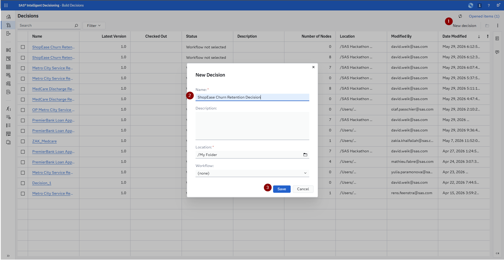

5. Navigate to the *Variables* tab, click on the *Add variable* dropdown and either select *Custom variable* if you want to add them all yourself of *Decision* if you want to copy it from the template (this is faster). The manual steps are described in the below sub steps 1 & 2 while the copy is described in step 3:
    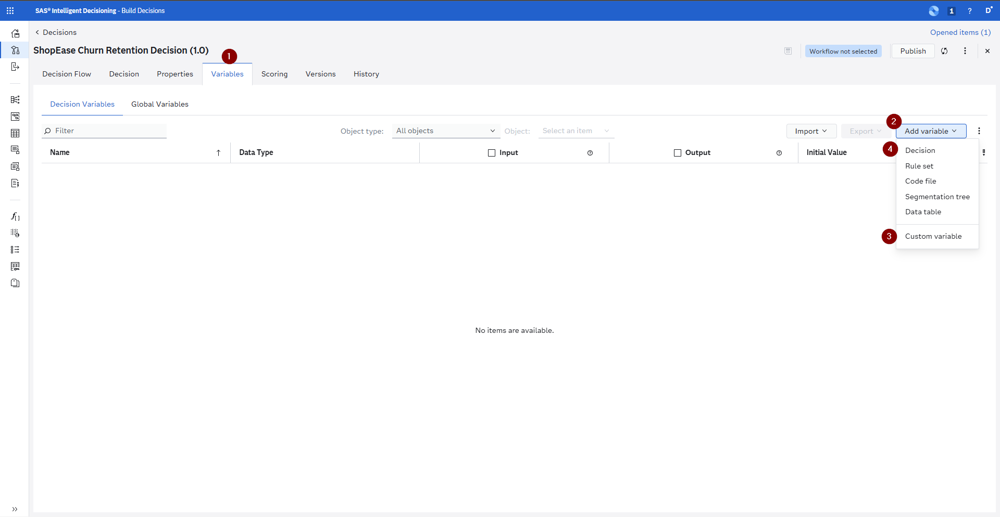
    
    1. Define the **input variables** (these will be passed in when the decision is called) - The structure is: `name` (data type):
        1. `subscription_tier` (character)
        2. `total_spend` (decimal)
        3. `days_since_last_purchase` (decimal)
        
    2. Define the **output variables** (what the decision returns)  - The structure is: `name` (data type) - Explanation (this is just for us as context):
        1. `offer_value` (decimal) - discount or incentive amount
        2. `action` (character) - the recommended retention action
        3. `risk_tier` (character) - risk classification
        4. `channel` (character) - preferred communication channel
        5. `priority` (character) - urgency of outreach
        6. `reason` (character) - why this retention action was selected
        7. Now click OK to add all of them
        
        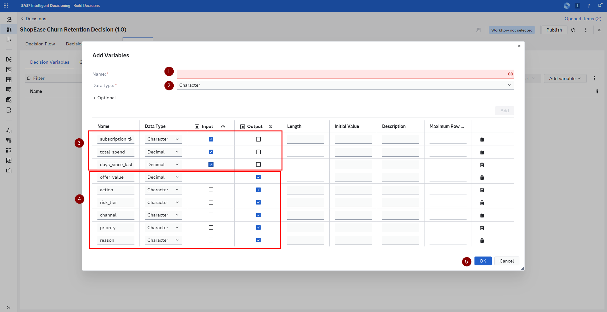
        
    3. Copy the **variables** from a template decision:
        1. Click on the folder icon in the *Decision* input field
        2. Navigate to *SAS Content > SAS Hackathon Bootcamp 2026 > Use Case Retail* select *ShopEase Churn Retention Decision* and click OK
        3. Click on the *Add all* icon in the middle of the dialogue to bring all the variables into your decision and then click the Add button

Once you have added the variables (no matter which way you choose) please click on the save icon in the upper right hand corner. It is recommended that anytime you change something about the variables before you continue to quickly use this icon to save the changes.


From here you can also always activate the SAS Viya Copilot via the icon in the top right hand corner to ask questions about SAS Intelligent Decisioning to deepen your understanding of the application.

### 2. Add the Model Node

1. Switch to the *Decision Flow* tab.
2. In the decision flow canvas, you can either right click the *Start* node and from the context menu select *Add below > Model* or on the right hand side click on the icon that looks a little bit like a postcard and from that side bar drag & drop a model node onto the *Start* node.
    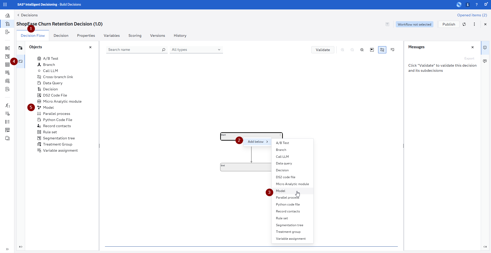
3. Select your registered champion model from SAS Model Manager or the pre-registered champion model by navigating to *DM Repository > ShopEase Customer Churn Prediction > Version 1 > Gradient Boosting (1) (SAS Automatically Generated Pipeline* and click OK.
    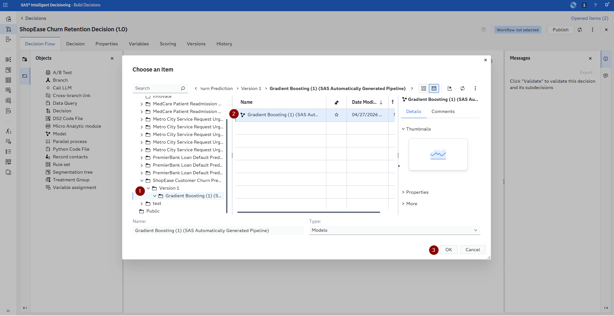
4. Upon doing this you will see a little red error icon next to the model and that is because it is missing variable inputs and outputs - we will address this in the next steps.
5. There are a lot of variables missing for the model to run. We are going to be clicking the *More* menu up top and select *Add missing variables* this will add all of the required output variables to our decision - if you copied the variables using the template they are already present - in the dialogue please make sure to deselect them from the Output as we will create our own custom outputs. The Inputs should be left in place.
    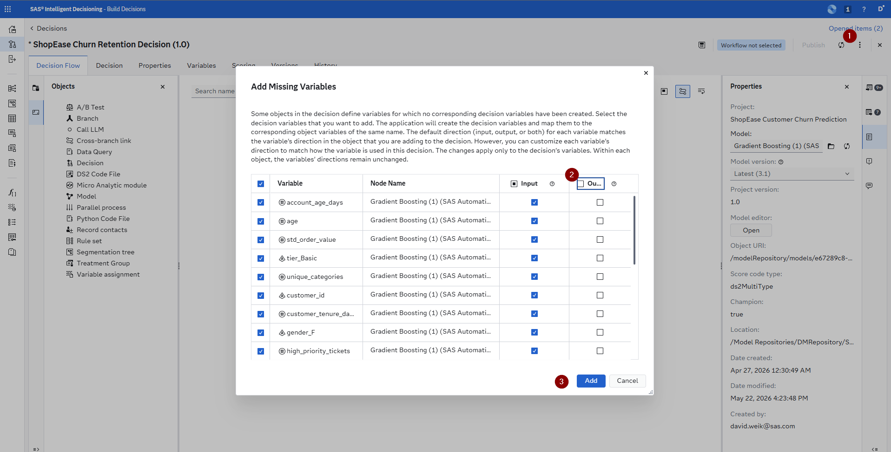


### 3. Add Business Rules

After the model scores the application, add **Rule Set** nodes to determine the lending decision. For this make first sure that you have clicked the save icon of your decision and than we will be adding Rule Sets to our decision.

There are two ways of adding **Rule Sets** to the decision:

1.    *The easy way*, where you use the pre build rule sets by clicking on the three vertical dots on the model node and selecting *Add > Rule Set*, then in the dialogue navigate to *SAS Content > SAS Hackathon Bootcamp 2026 > Use Case Retail* and add the rule set as specified below.
2.    *The learning way*, if you want to create them yourself you can go to the right hand side click on the *Objects* (postcard icon) and drag & drop a Rule Set onto the previous node. This will open up a dialogue where you should name your decision correspondingly, please leave the location as the default (*My Folder*) - then add the variables from the decision you created and start building the Rule Sets as described below - the required variables are noted either as the columns or in the **Rule Conditions**. The first rule set we will be building has notes and screenshots attached on how to do this.

We recommend you try to build at least one of these rule sets yourself to get an understanding of how it is done. If you have any questions around SAS Intelligent Decisioning activate the SAS Viya copilot within the application via the icon in the top right hand corner next to your profile or ask one of the onsite SAS Mentors.

**Rule Set: Risk Tier Classification**

1.   From the *Objects* side panel drag and drop a *Rule Set* node onto the *Model* node you already have in your decision. Then enter the name from above and click *Save*
     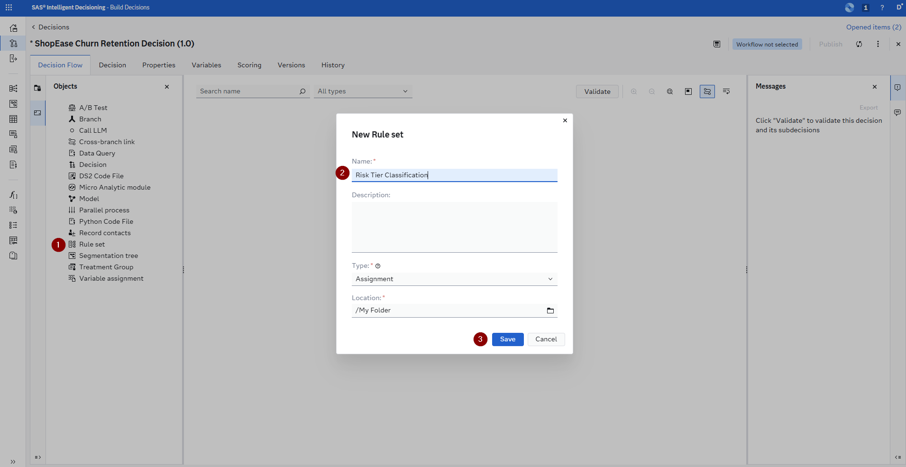
2.   Now on the right hand side you will see the *Properties* pane for this new *Rule Set* and there is a button *Open* that will take you to the *Rule set editor* so that you can build the decision so click on that button.
3.   A new UI opened up for you on the *Variables* tab for the *Rule Set*, under *Add variable* select, via the folder icon navigate to *My Folder* and select the *ShopEase Churn Retention Decision* that you have already created. Select the **P_churned1 ** & **risk_tier** variables and add it to the Rule Set - the **P_churned1 ** variable is specified in the Rule Conditions column in the table below and the **risk_tier** variable has its own column as it gets assigned values.
     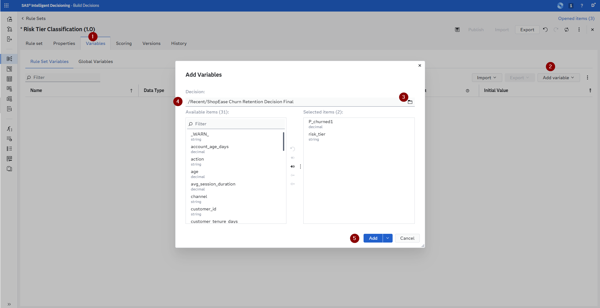
4.   For the **P_churned1** change it so that it is required as an input and then click on the save icon to add this change. The **risk_tier** currently doesn't have any value from the decision so we can just leave it as an output.
     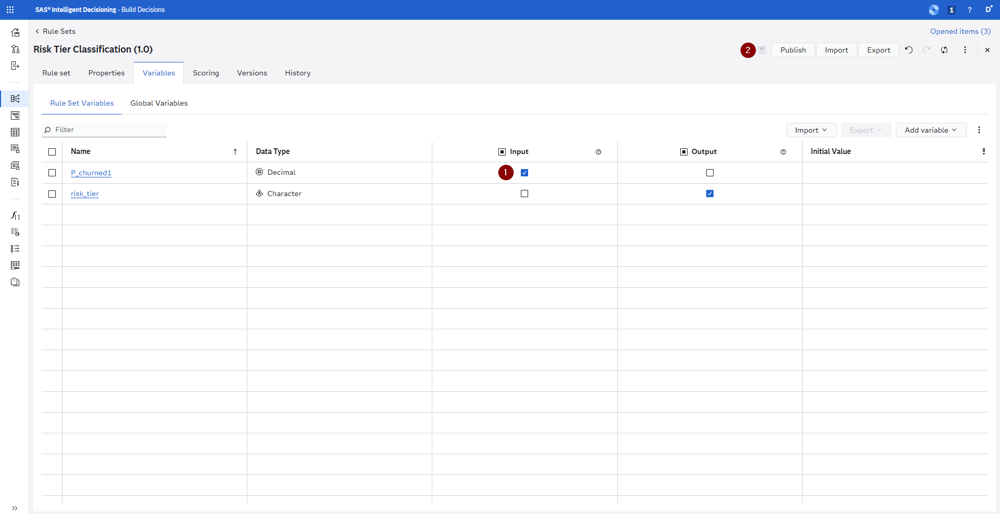
5.   Navigate to the *Rule set* tab and click on the *Add rule* button
     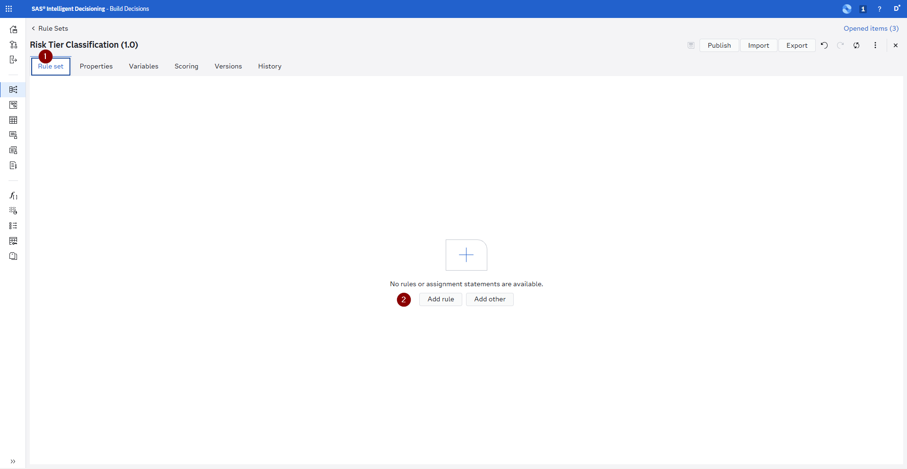
6.   Change the operator from the default of equal to greater than and then enter the comparison in the *IF* condition, in the THEN assignment change the variable to **risk_tier** and enter the corresponding value into the field enclosed in single quotes.
     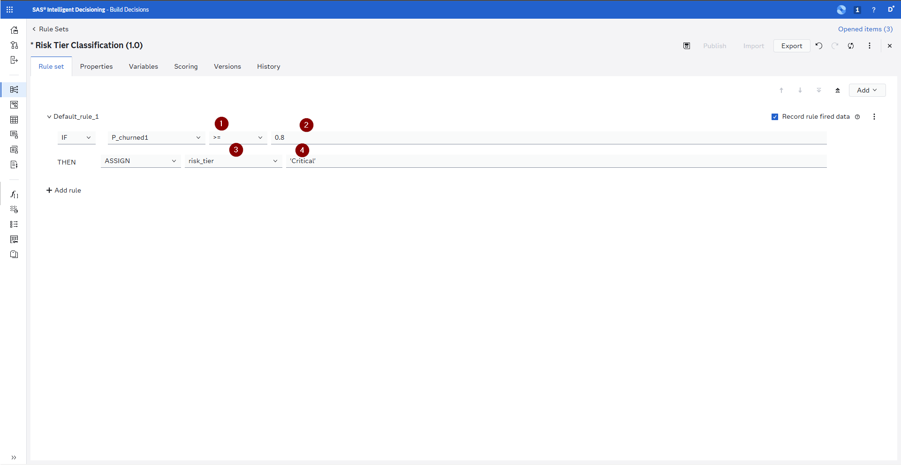
7.   Next click on *Add rule* and click on the *IF* statement dropdown and change it to an *ELSE* condition. This will combine the additional condition into one rule. From here continue to enter all the rest of the conditions and assignments as listed below and once you are done click on the save icon and then either use the little *x* icon in the right hand corner or click on *** ShopEase Churn Retention Decision (1.0)* in the breadcrumb navigation up top to navigate back to the decision.
     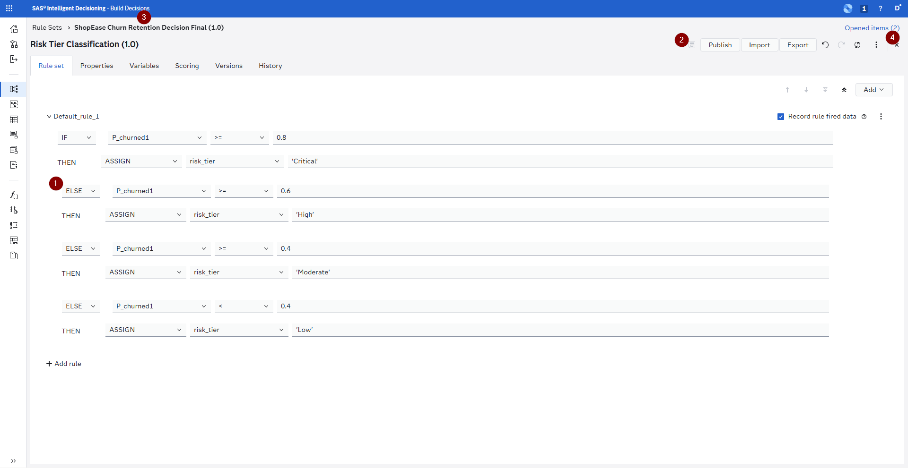

| Rule Conditions | risk_tier |
|-----------|-----------|
| P_churned1 >= 0.80 | Critical |
| P_churned1 >= 0.60 | High |
| P_churned1 >= 0.40 | Moderate |
| P_churned1 < 0.40 | Low |

**Rule Set: Retention Action**

| risk_tier | subscription_tier | action | offer_value |
|-----------|------------------|--------|-------------|
| Critical | Basic | Upgrade offer + personal call | 50 |
| Critical | Standard / Premium | Personal call from account manager | 25 |
| High | Basic | Targeted email with discount | 20 |
| High | Standard / Premium | Re-engagement email sequence | 10 |
| Moderate | Any | Automated engagement nudge | 0 |
| Low | Any | No action (continue monitoring) | 0 |

**Rule Set: Channel Selection**

| Rule Conditions | channel |
|-----------|---------|
| days_since_last_purchase > 90 | Phone call |
| days_since_last_purchase > 60 | Email + SMS |
| days_since_last_purchase > 30 | Email |
| days_since_last_purchase <= 30 | In-app notification |

**Rule Set: Priority Assignment**

| Rule Conditions | priority |
|-----------|----------|
| risk_tier = 'Critical' AND total_spend > 500 | Urgent |
| risk_tier = 'Critical' OR (risk_tier = 'High' AND total_spend > 300) | High |
| risk_tier = 'High' OR risk_tier = 'Moderate' | Normal |
| risk_tier = 'Low' | None |

**Rule Set: Reason Assignment**

These rules capture the dominant driver behind the retention action and populate the `reason` variable used downstream by the LLM:

| Rule Conditions | reason |
|-----------|----------|
| days_since_last_purchase > 90 | Prolonged inactivity |
| total_spend < 100 AND P_churned1 >= 0.60 | Low engagement and spend |
| subscription_tier = 'Basic' AND P_churned1 >= 0.60 | Tier-downgrade risk |
| avg_session_duration < 60 AND total_sessions < 5 | Weak browsing engagement |
| Otherwise | Standard retention outreach |

### 4. Adding an LLM to the Mix

We are going to be adding a Large Language Model to our decision now. For this please open up the *Objects* side bar (postcard icon) and drag & drop a Call LLM node onto the *End* node. Then go ahead and add the missing variables like you did for the model node (do not make the prompt a required input for the decision) - and make sure to click on the save icon.

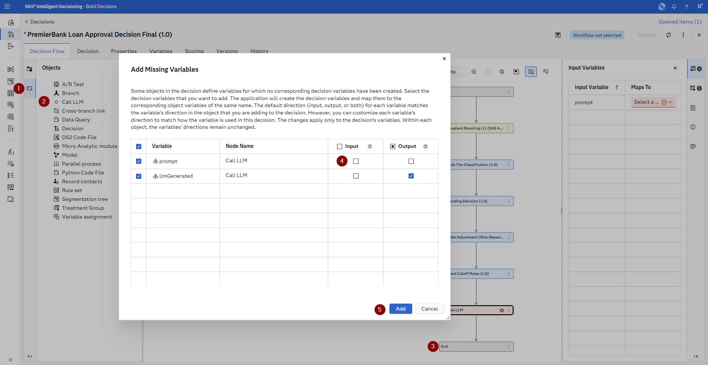

Now you can either add the *Prompt Assignment* Rule Set to the decision just like you added the other Rule Sets before or you can create it yourself. If you choose to create it yourself, please add the following variables from your decision as inputs to it:

-   subscription_tier
-   total_spend
-   risk_tier
-   action
-   offer_value
-   channel
-   priority
-   reason

And as output add the prompt variable (do not forget to click the save icon). Then switch to the *Rule set* tab, click on the *Add other* button, select the Rule type of *Assignment* and click *OK* - as we do not want to do a condition, but rather just fill in our prompt with a long value.

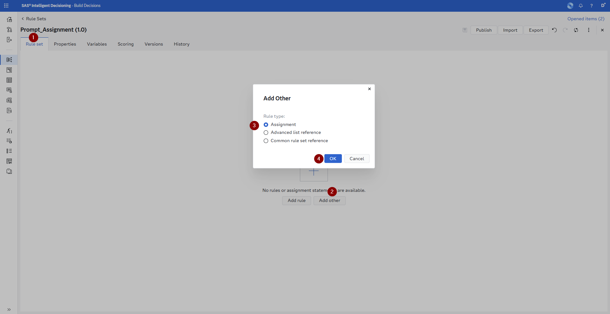

Next you are going to assign the prompt value by clicking on the pencil icon, in the *Expression Editor* removing all the values from the main editor and the copy and paste the value from below into it, then click the *Save* button, the save icon on the *Rule set* and return to the main decision.

```
prompt = CAT('You are a helpful ShopEase customer retention specialist. Using the customer profile and retention decision data below, write a warm, personalized, and clearly structured long-form outreach message (3 to 5 paragraphs) that a human account manager can review and send through their preferred channel. Do not reference internal codes or jargon verbatim — translate them into plain customer-friendly language. Do not promise outcomes beyond the specified offer, and do not disclose the underlying model score or risk tier to the customer. Customer profile and decision context: Subscription tier: ', subscription_tier, '. Total spend to date: $', total_spend, '. Assigned risk tier: ', risk_tier, '. Recommended action: ',  action, '. Offer value: $', offer_value, '. Outreach channel: ', channel, '. Outreach priority: ', priority, '. Internal reason code: ', reason, '. Structure your response as follows. First, open with a warm, sincere thank-you that acknowledges the customer as a ', subscription_tier, ' member and references their $', total_spend, ' of lifetime spend in a natural, non-transactional way. Second, acknowledge — without explicitly revealing the ', risk_tier, ' risk tier — that ShopEase has noticed it has been a while and that we value their continued relationship. Translate the internal reason ', reason, ' into an empathetic, plain-language acknowledgment of what might have driven the drop in engagement. Third, present the recommended action ', action, ' as a thoughtful offer rather than a retention tactic, explaining the concrete $', offer_value, ' benefit in clear terms (how and when it can be redeemed). Fourth, adapt the tone to the ', channel, ' channel (concise and scannable for email or SMS, warmer and conversational for a phone script) and to the ', priority, ' outreach priority (immediate urgency vs gentle reminder). Fifth, close with a clear, low-friction next step — a single link, a reply, or a brief call — and invite the customer to share feedback about their recent experience. Tone: warm, appreciative, human, and never guilt-tripping or salesy. Length: 250 to 400 words. Write in the second person (you, your account).')
```

This is a very simplistic approach to prompt engineering and also doesn't provide you with the ability to test and compare different large languages models. That is why SAS provides the [SAS Agentic AI Accelerator](https://github.com/sassoftware/sas-agentic-ai-accelerator) open-source project, which enables you to connect any LLM and do extensive prompt engineering & monitoring, but here we have a hard coded LLM (OpenAI GPT 5.4) available.

### 5. Test the Decision

1. In the decision click on the *Scoring* tab and then in there click on the *Scenarios* sub tab

2. Click on the *New test* button
    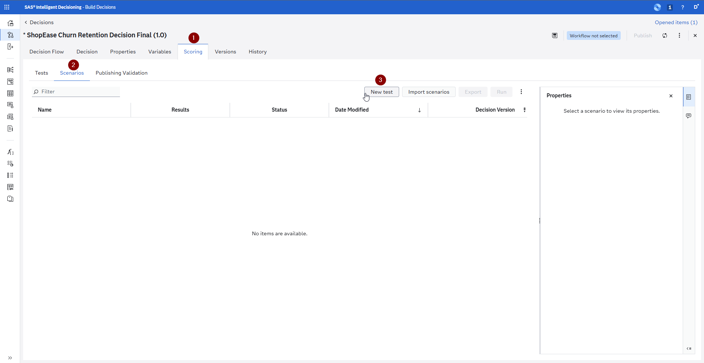

3. Enter sample values:
   - account_age_days: 294
   - age: 23
   - avg_session_duration: 45
   - customer_id: C501
   - customer_tenure_days:  500
   - days_since_last_purchase: 75
   - email_opt_in: 1
   - gender_F: False
   - high_priority_tickets: 3
   - max_order_value:  123
   - max_resolution_time: 6
   - min_order_value: 7
   - std_order_value: 54
   - subscription_tier: Basic
   - tier_Basic: True
   - total_sessions: 8
   - total_spend: 250
   - unique_categories: 1

   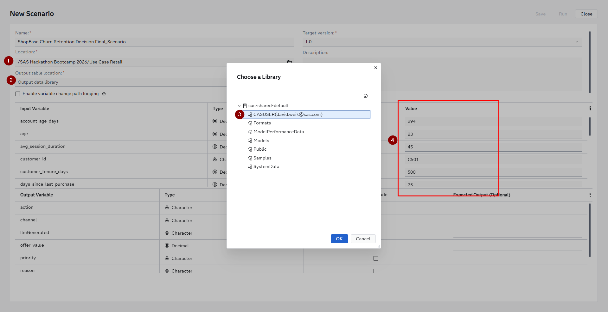

4. Review the output by clicking on the Results icon once the *Status* as switched to a green check mark
    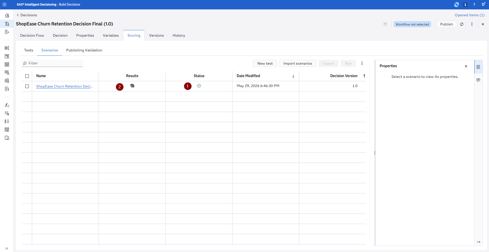

5. Feel free to further test with different scenarios to validate the logic:
   - A strong, engaged customer (low churn probability, high spend, recent activity) should fall into Low risk with no action
   - A borderline customer should receive an automated engagement nudge
   - A Critical-risk Basic-tier customer should be flagged for a personal call with Urgent priority

### 6. Publish the Decision

1. Click the **Validate** button and then **Publish** to make the decision available as a callable service
2. Choose a **destination:**
   - **CAS** — for batch execution against your full customer base
   - **MAS (Micro Analytic Service)** — for real-time, low-latency API calls - only one available here!
   - **Container** — for deployment in external systems
3. Please make sure to give it a unique name
4. Once published, the decision is available as a REST API endpoint

---

## Using the SAS Intelligent Decisioning Copilot

The Copilot in SAS Intelligent Decisioning is a conversational assistant that can answer questions about the documentation for **SAS Intelligent Decisioning**, **SAS Container Runtime**, and **SAS Micro Analytic Service**. Use it to quickly find information about how these products work without leaving the application.

### What the Copilot Can Do

- **Answer documentation questions** about SAS Intelligent Decisioning features, concepts, and workflows
- **Explain SAS Micro Analytic Service (MAS)** deployment options, configuration, and API usage
- **Clarify SAS Container Runtime** setup, publishing, and management
- **Help you navigate** product capabilities by describing how specific features work
- **Provide guidance** on decision flow concepts, rule set configuration, and publishing options based on the official documentation

### Example Copilot Prompts

- *"How do I publish a decision to MAS?"*
- *"What is the difference between CAS and MAS as publishing destinations?"*
- *"How does SAS Container Runtime work for deploying decisions?"*
- *"What types of nodes can I add to a decision flow?"*
- *"How do I configure input and output variables for a decision?"*
- *"What are rule sets and how do I create them?"*

The Copilot is a useful reference tool for quickly getting answers about the platform's capabilities while you are building your decision flows.

---

## Decisions as Tools in Agentic Workflows

A published SAS Intelligent Decisioning decision is exposed as a **REST API endpoint**. This means it can be called as a **tool** by any AI agent — including large language model (LLM) agents that use tool-calling capabilities.

### How This Works

```
┌──────────────┐     ┌─────────────────────────┐     ┌──────────────────┐
│   AI Agent   │────▶│  SAS Intelligent         │────▶│  Retention       │
│  (e.g. LLM)  │     │  Decisioning API         │     │  Action          │
│              │◀────│  /decisions/churnRetention│◀────│  Recommendation  │
└──────────────┘     └─────────────────────────┘     └──────────────────┘
```

**Example scenario:** A customer service agent (powered by an LLM) is chatting with a customer who seems frustrated. The agent can:

1. Look up the customer's profile
2. **Call the SAS Intelligent Decisioning API** with the customer's data
3. Receive back: "Critical risk — offer $50 credit + personal follow-up"
4. Tailor its response accordingly, proactively offering the retention incentive

The decision becomes a **tool** in the agent's toolkit, just like a search function or a database query. This bridges the gap between analytical models and conversational AI.

### Why This Matters

- **Consistency:** Every agent interaction uses the same decision logic — the rules and model scores are centralized, not hardcoded into prompts
- **Governance:** The decision is version-controlled and auditable in SAS Intelligent Decisioning, not buried in an LLM's system prompt
- **Separation of concerns:** Data scientists own the model, business analysts own the rules, and the AI agent just calls the endpoint
- **Real-time execution:** MAS endpoints return in milliseconds, fast enough for conversational use

---

## Decisions as Agentic Workflows

Beyond being called as tools, SAS Intelligent Decisioning can itself orchestrate **agentic workflows** — multi-step processes that autonomously execute a chain of decisions and actions.

### How a Decision Becomes an Agent

An agentic decision flow goes beyond simple "input → rules → output." It can:

1. **Observe:** Receive a trigger event (e.g., a customer hasn't logged in for 30 days)
2. **Reason:** Score the customer's churn risk, check their segment, review their interaction history
3. **Decide:** Select the optimal retention action from the rule sets
4. **Act:** Trigger downstream actions — send an email, create a CRM task, schedule a callback, adjust an ad campaign
5. **Monitor:** Track whether the customer re-engages and feed that outcome back into future decisions

### Example: Automated Churn Prevention Agent

```
┌─────────────┐     ┌──────────────────┐     ┌──────────────────┐
│  Event       │     │  Decision Flow   │     │  Actions         │
│  Trigger     │────▶│                  │────▶│                  │
│              │     │  1. Score model   │     │  • Send email    │
│  "Customer   │     │  2. Apply rules   │     │  • Create CRM    │
│   inactive   │     │  3. Select action │     │    task          │
│   30 days"   │     │  4. Choose channel│     │  • Schedule call │
│              │     │  5. Set priority   │     │  • Adjust offer  │
└─────────────┘     └──────────────────┘     └──────────────────┘
                              │
                              ▼
                    ┌──────────────────┐
                    │  Feedback Loop   │
                    │                  │
                    │  Did customer    │
                    │  re-engage?      │
                    │  Update model.   │
                    └──────────────────┘
```

This is **agentic** because the system autonomously:
- Detects the trigger condition
- Makes decisions without human intervention
- Executes real-world actions
- Learns from outcomes

### Scaling Agentic Decisioning

In a production environment, this agentic workflow can process **thousands of customers per day** without manual intervention:

- **Batch mode:** Every Monday, score all 1,000+ customers, identify at-risk ones, trigger actions
- **Event-driven mode:** As soon as a customer's inactivity crosses a threshold, trigger the flow in real time
- **Multi-decision chaining:** One decision flow calls another — e.g., the churn decision calls a "next best offer" decision which calls a "channel optimization" decision

SAS Intelligent Decisioning provides the orchestration layer that turns individual models and rules into **enterprise-scale autonomous agents**.

---

## Summary

In this step you have:

1. **Created a decision flow** that combines your churn model with business rules to produce actionable retention recommendations
2. **Added an LLM call** that turns the decision into a warm, personalized customer outreach message
3. **Used the Copilot** to get answers about SAS Intelligent Decisioning, MAS, and Container Runtime documentation
4. **Published the decision** as a callable API endpoint
5. **Learned how decisions work as tools** for LLM-powered agents
6. **Explored agentic workflows** where decisions autonomously detect, reason, decide, and act

---

## Congratulations!

You have completed the full Data and AI Life Cycle for the ShopEase customer churn use case:

| Step | What You Did | SAS Technology |
|------|-------------|---------------|
| 1. Ask & Access | Understood the problem, generated synthetic data | SAS Data Maker |
| 2. Prepare | Loaded, profiled, and joined data into an ABT | SAS Viya Workbench |
| 3. Explore | Visually explored patterns with AI assistance | SAS Visual Analytics + Copilot |
| 4. Model | Built, compared, and fairness-tested models | SAS Model Studio + Copilot |
| 5. Deploy & Act | Operationalized with automated decisions | SAS Intelligent Decisioning + Copilot |

If you have time remaining, explore another use case or dive deeper into any step. Talk to your bootcamp mentor for follow-up topics or to share feedback.
